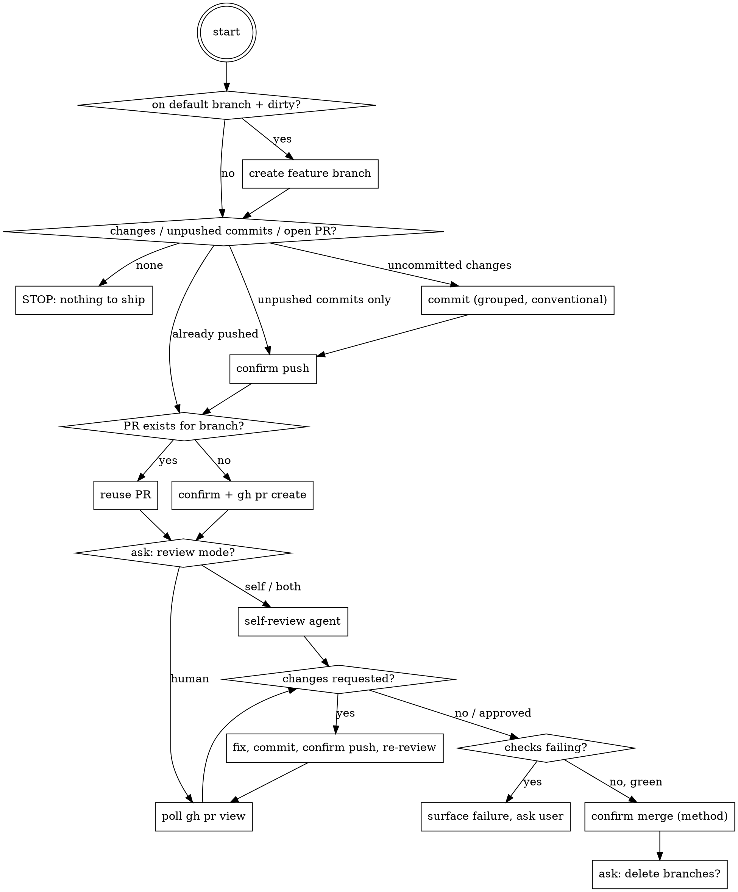

# Shipping a Branch

## Overview

End-to-end git workflow: commit → push → open PR (or reuse existing) → review → merge → cleanup. Orchestrates existing skills/tools rather than reimplementing them. Every high-blast-radius action (push, PR create, merge, branch delete) gets a **fresh, per-action confirmation** — no matter what the user said earlier in the conversation.

**Core principle:** Invoking this skill IS the user's ask to commit. It is NOT pre-authorization for push, PR, merge, or cleanup — each of those is confirmed separately, every time.

## When to Use

- User says "ship this", "commit and open a PR", "get this merged", or runs `/ship`
- NOT for commit-only ("just commit this") — do that directly, skip this skill
- NOT for review-only on an existing PR — use `ecc:review-pr` or `superpowers:requesting-code-review` directly
- NOT for opening a PR on an already-pushed branch with no new changes — skip to Phase 3

## Workflow

### Phase 0 — Preconditions

Run `git status`, `git branch --show-current`, `gh repo view --json defaultBranchRef`, `gh pr list --head <branch>`.

- On the default branch with dirty changes → create a feature branch first (name it from the change summary) before committing.
- No uncommitted changes, no unpushed commits, and no open PR → nothing to ship. Report and stop.
- No uncommitted changes but unpushed commits or an open PR exist → skip straight to the relevant phase (don't re-commit or re-create).

### Phase 1 — Commit

Group changes logically, write conventional-commit messages (`feat:`, `fix:`, `refactor:`, etc.), no `Co-Authored-By` or "Generated with Claude Code" trailers. The user invoking this skill is the explicit commit authorization — no extra confirmation needed for the commit itself.

### Phase 2 — Push ⛔ CONFIRM

Surface: branch name, remote, commit count + subject lines, whether this is a new branch or an update to an existing one. Wait for explicit yes before pushing. Push rejected (non-fast-forward)? Fetch/rebase or ask the user — **never force-push to "fix" a rejection**.

### Phase 3 — PR create-or-reuse

`gh pr list --head <branch>` first, always — never create a duplicate PR.

- Open PR already exists → reuse it (the push in Phase 2 already updated it). No confirmation needed to "reuse."
- No PR exists → ⛔ CONFIRM: surface title, base←head, a 2-3 line summary, and whether it should be a draft. Then `gh pr create`.

### Phase 4 — Review

Ask the user: human review, self-review, or both?

- **Self-review**: delegate to `superpowers:requesting-code-review` (or `ecc:code-review`); process findings via `superpowers:receiving-code-review`.
- **Human review**: poll `gh pr view --json reviews,reviewDecision,statusCheckRollup`. If pending, offer to stop here and resume later — **never fabricate or assume approval**, and never call `gh pr review --approve` on your own PR.
- Changes requested → fix, commit, re-confirm push (Phase 2 rules apply again), loop back to review check.

### Phase 5 — Merge ⛔ CONFIRM

Only proceed once checks are green AND the chosen review mode is satisfied. Checks red? Surface the failure and ask the user — do not merge over red checks by assuming "unrelated flake."

Confirm: PR number, title, merge method (squash/merge/rebase — ask, or read the repo's allowed methods via `gh repo view`). For the underlying merge-vs-close-vs-keep-open decision framing, defer to `superpowers:finishing-a-development-branch`.

### Phase 6 — Cleanup ⛔ ASK

Ask whether to delete the local and/or remote branch, and whether to pull the base branch locally. Never delete branches without asking, even post-merge.

## Relationship to Other Tools

| Tool | Scope | When to prefer it instead |
|---|---|---|
| `ecc:pr` | Create a single PR | User only wants a PR opened, not the full ship flow |
| `ecc:review-pr` | Review a single existing PR | User only wants a review, no push/merge intent |
| `superpowers:requesting-code-review` | Self-review during Phase 4 | Called *by* this skill, not standalone here |
| `superpowers:finishing-a-development-branch` | Merge/cleanup decision framing | Called *by* this skill for Phase 5/6 framing |

Mid-flow, prefer inline `gh`/`git` commands over invoking `ecc:pr`/`ecc:review-pr` as separate skills — nesting workflows adds overhead without adding safety.

## Red Flags — Do Not Rationalize Past These

| Excuse | Reality |
|---|---|
| "User said ship it, so merge is pre-authorized" | No. Each ⛔ checkpoint is a fresh confirmation, regardless of earlier phrasing. |
| "Push got rejected, force-push to fix it" | Never. Fetch/rebase or ask the user. |
| "Diff is tiny, skip the review step" | Which review mode (or none) is the user's call, not Claude's. |
| "Checks are red but it's an unrelated flake" | Surface it and let the user decide — don't merge over red. |
| "Human review is pending but the change is obviously fine" | Never approve your own PR or assume approval. Wait or let the user resume later. |
| "Amend the pushed commit to keep history clean" | Don't amend published commits — make a new commit instead. |
| "No PR exists yet, let me just create one" (without checking) | Always run `gh pr list --head <branch>` first — duplicate PRs are a real failure mode. |
| "Merged — I'll clean up the branches too" | Ask before deleting, even after a successful merge. |

## Common Mistakes

- Skipping the `gh pr list --head` check and creating a second PR for the same branch.
- Treating a broad "let's get this shipped" from earlier in the conversation as covering the push/merge confirmations later — it doesn't (see Instruction Priority in the main system prompt: permission is per-action, not generalized).
- Force-pushing after a rejected push instead of rebasing or asking.
- Running full CI-check polling in a tight loop instead of a reasonable interval or asking the user to say when it's ready.

## Note (poka-yoke)

The confirmation chain in this skill is itself a motion-step/fixed-value guard. Don't add new "shortcuts/exceptions" to it in a future edit without checking that the shortcut isn't reopening a side-door this skill was built to close.
